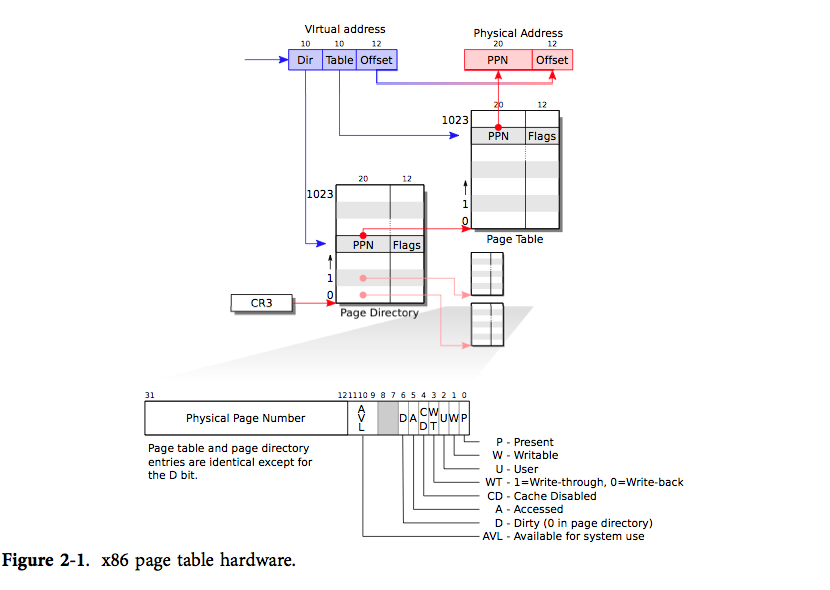

# CPU 如何执行一条语句

> cpu执行一条语句时，如何取出操作指令和操作数？如何进行寻址？与内存分段分页有什么关系？

## CPU 执行指令

假如我们现在有一条指令 `a = 1 + 2` ，cpu 不认识它，因此需要进行编译处理。

```asm
load r0 addr1  # load 1 into r0
load r1 addr2  # load 2 into r1
add r2 r0 r1   # add r0 and r1 and store the result in r2
store r2 addr3 # store the result in addr3
```

其中，`addr1` 和 `addr2` 代表的是 `1` 和 `2` 在程序加载到内存后的 `.data` 地址，`addr3` 代表的是 `a` 的地址。

回到正题：CPU如何执行一条语句？看看一条指令的执行周期。

- 取指令（Fetch）：CPU从内存中取出一条指令，并将其送入指令寄存器，从哪里取呢？PC 寄存器，这里保存着下一条指令。
- 译码（Decode）：对于每一条指令，也就是一个二进制机器码，在 CPU 中通过解码器解析这个二进制，并确定指令的操作数和操作码
- 执行（Execute）：通过一些运算器，比如 ALU ，执行对应的操作
- 存储（Store）：将运算结果写回存储

整个过程符合冯诺依曼架构，即：输入输出、控制、运算、存储

## 如何寻址 | 与内存分段分页有什么关系

这主要是涉及到操作数的逻辑。

- 立即寻址：指令中的操作数就是我们需要的数字
- 直接寻址：指令中的操作数就是一个写死的地址，从这个地址找到操作数，需要跳一次
- 间接寻址：指令中的操作数是一个地址，但是这个地址指向的内容依然是一个另外的地址，所以需要跳很多次
- 寄存器寻址：指令中的操作数是一个寄存器，直接从寄存器中取出操作数
- 寄存器间接寻址：其实就是寄存器里面存了个地址

那么如果是需要一个地址，CPU 如何找到这个地址呢？

### 内存管理单元（MMU）

现代操作系统和 CPU 基本都采用了**虚拟内存**的方式，在用户空间一定是虚拟地址，在内核空间中也是虚拟地址，那么自然是需要进行地址转换的。



现在的操作系统基本都是分页式的，因此对于给定的一个虚拟内存地址，将其剖分为几段就可以找到对应的物理内存地址。

这里是 xv6 虚拟地址转换为物理地址的方式，仔细看下注释，那么对于一个给定的虚拟地址，其实就分成几段，第一段先找到总的页表中对应地址的 PTE ，然后通过这个 PTE 找到第二级页表，再找，到第三，最后就是真正的物理地址了。

```c
#define PXMASK          0x1FF // 9 bits
#define PXSHIFT(level)  (PGSHIFT+(9*(level)))
#define PX(level, va) ((((uint64) (va)) >> PXSHIFT(level)) & PXMASK)

#define PTE2PA(pte) (((pte) >> 10) << 12)
#define PA2PTE(pa) ((((uint64)pa) >> 12) << 10)

// Return the address of the PTE in page table pagetable
// that corresponds to virtual address va.  If alloc!=0,
// create any required page-table pages.
//
// The risc-v Sv39 scheme has three levels of page-table
// pages. A page-table page contains 512 64-bit PTEs.
// A 64-bit virtual address is split into five fields:
//   39..63 -- must be zero.
//   30..38 -- 9 bits of level-2 index.
//   21..29 -- 9 bits of level-1 index.
//   12..20 -- 9 bits of level-0 index.
//    0..11 -- 12 bits of byte offset within the page.
pte_t *walk(pagetable_t pagetable, uint64 va, int alloc)
{
  if(va >= MAXVA)
    panic("walk");

  for(int level = 2; level > 0; level--) {
    pte_t *pte = &pagetable[PX(level, va)];
    if(*pte & PTE_V) {
      pagetable = (pagetable_t)PTE2PA(*pte);
    } else {
      if(!alloc || (pagetable = (pde_t*)kalloc()) == 0)
        return 0;
      memset(pagetable, 0, PGSIZE);
      *pte = PA2PTE(pagetable) | PTE_V;
    }
  }
  return &pagetable[PX(0, va)];
}
```

MMU 就是在硬件上直接做了这件事，大体上的内存都是分页的方式的。

### 分段

分段则是一个程序加载到内存中时，不一定给你一个连续的内存空间，而是直接分成好几个段，每个段只需要加上偏移量就可以知道其他段的地址了。现在基本都是段页混合的方式。
