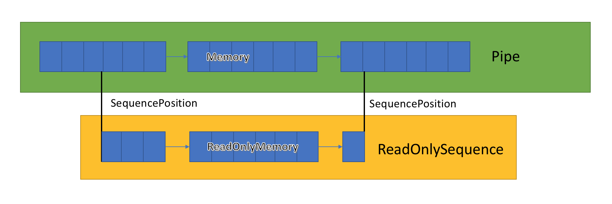

# TCP 粘包问题

TCP 粘包原因如下：

- TCP 面向字节流传输，流水很难界定边界
- TCP 在发送数据包时，会通过使用缓冲区来进行优化
  - 如果发送的数据比较小，且对方应答报文 `SYN` 没有发送过来，且开启了
  - 如果发送的数据大于缓冲区大小，那么数据将拆开为多个报文

解决办法：

- 通信双方协商一个包传输的大小，只传输固定长度的消息
- 特殊字符作为边界，比如 HTTP 中的 `\r\n`
- 将消息分为消息头或者消息体
  - 也就是每个包的开头加点信息，说明传输数据的大小

比如使用 `System.IO.Pipeline` ，可以找规定结束符号的地方，将消息分割为多个包。

## 粘包拆包处理

在 `C#` 中可以使用 `Pipeline` 和 `ReadOnlySequence` 来解决这个问题。

`Pipeline` 有两个对象成员，一个是 `PipeWriter` ，一个是 `PipeReader` ，简单来说一个是生产者，一个是消费者。`PipeWriter` 负责向管道写入数据流，`PipeReader` 读取管道中的数据流。

一般来说使用 `Pipeline` 来解决粘包问题，主要还是看协议规定的分割方式，比如规定包的大小，还是规定结尾字符。
