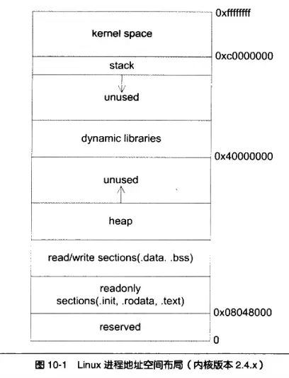

# 把一系列字符打印到屏幕上发生了什么

对于下面的代码来说，我们都知道其会输出 Hello, world! 到屏幕上，但是具体做了什么？

```c
// main.c
#include <stdio.h>

int main() {
    printf("Hello world!\n");
}
```

## 编译过程

首先，这段代码会先进行编译，也就是预处理、编译、汇编、链接。

> 为了方便起见，这里直接用 clang 代替各种 as ld 等工具链，但是底层都是调用这些的。

### 预编译

```sh
clang -E main.c -o main.i
```

在预编译阶段，本身代码只会进行一些移除注释、宏展开、头文件包含等操作，并不会真正编译代码。

```c
extern void funlockfile (FILE *__stream) __attribute__ ((__nothrow__ )) __attribute__ ((__nonnull__ (1)));
# 949 "/usr/include/stdio.h" 3 4
extern int __uflow (FILE *);
extern int __overflow (FILE *, int);
# 2 "main.c" 2

int main() {
  printf("Hello world!\n");
}
```

### 编译

到这一步，则是开始生成汇编代码了。不过这一步其实包含着中间代码生成，比如输入 `clang -S -emit-llvm main.c -o main.ll` 则会生成 LLVM IR 代码。然后这部分中间代码给后端 llvm 处理，就可以生成机器码了。

```llvm ir
; ModuleID = './main.c'
source_filename = "./main.c"
target datalayout = "e-m:e-p270:32:32-p271:32:32-p272:64:64-i64:64-i128:128-f80:128-n8:16:32:64-S128"
target triple = "x86_64-suse-linux"

@.str = private unnamed_addr constant [14 x i8] c"Hello world!\0A\00", align 1

; Function Attrs: noinline nounwind optnone uwtable
define dso_local i32 @main() #0 {
  %1 = call i32 (ptr, ...) @printf(ptr noundef @.str)
  ret i32 0
}

declare i32 @printf(ptr noundef, ...) #1

attributes #0 = { noinline nounwind optnone uwtable "frame-pointer"="all" "min-legal-vector-width"="0" "no-trapping-math"="true" "stack-protector-buffer-size"="8" "target-cpu"="x86-64" "target-features"="+cmov,+cx8,+fxsr,+mmx,+sse,+sse2,+x87" "tune-cpu"="generic" }
attributes #1 = { "frame-pointer"="all" "no-trapping-math"="true" "stack-protector-buffer-size"="8" "target-cpu"="x86-64" "target-features"="+cmov,+cx8,+fxsr,+mmx,+sse,+sse2,+x87" "tune-cpu"="generic" }

!llvm.module.flags = !{!0, !1, !2, !3, !4}
!llvm.ident = !{!5}

!0 = !{i32 1, !"wchar_size", i32 4}
!1 = !{i32 8, !"PIC Level", i32 2}
!2 = !{i32 7, !"PIE Level", i32 2}
!3 = !{i32 7, !"uwtable", i32 2}
!4 = !{i32 7, !"frame-pointer", i32 2}
!5 = !{!"clang version 18.1.8"}
```

不过在此之前，还是直接看看生成汇编代码的处理吧。

```sh
clang -S main.c -o main.s
```

```asm
	.text
	.file	"main.c"
	.globl	main                            # -- Begin function main
	.p2align	4, 0x90
	.type	main,@function
main:                                   # @main
	.cfi_startproc
# %bb.0:
	pushq	%rbp
	.cfi_def_cfa_offset 16
	.cfi_offset %rbp, -16
	movq	%rsp, %rbp
	.cfi_def_cfa_register %rbp
	leaq	.L.str(%rip), %rdi
	movb	$0, %al
	callq	printf@PLT
	xorl	%eax, %eax
	popq	%rbp
	.cfi_def_cfa %rsp, 8
	retq
.Lfunc_end0:
	.size	main, .Lfunc_end0-main
	.cfi_endproc
                                        # -- End function
	.type	.L.str,@object                  # @.str
	.section	.rodata.str1.1,"aMS",@progbits,1
.L.str:
	.asciz	"Hello world!\n"
	.size	.L.str, 14

	.ident	"clang version 18.1.8"
	.section	".note.GNU-stack","",@progbits
	.addrsig
	.addrsig_sym printf
```

### 汇编

汇编代码还需要通过汇编器，进行汇编，生成目标代码。

```sh
clang -c main.s -o main.o
```

然后看一下 `main.o` 的内容。

```sh
$ objdump -d main.o

main.o:     file format elf64-x86-64


Disassembly of section .text:

0000000000000000 <main>:
   0:   55                      push   %rbp
   1:   48 89 e5                mov    %rsp,%rbp
   4:   48 8d 3d 00 00 00 00    lea    0x0(%rip),%rdi        # b <main+0xb>
   b:   b0 00                   mov    $0x0,%al
   d:   e8 00 00 00 00          call   12 <main+0x12>
  12:   31 c0                   xor    %eax,%eax
  14:   5d                      pop    %rbp
  15:   c3                      ret
```

### 链接

最后通过链接器进行链接，生成可执行文件。

```sh
$ clang main.o -o main.out
```

然后这样就可以运行了，确实，但是之后呢？

## 运行

```sh
$ ./main.out
Hello world!
```

但是这个过程发生了什么？

### 运行内存布局

这里就按 linux 的程序内存布局进行描述：



上面是内核态的地址空间，下面是用户态的地址空间。

- stack：用户态的栈，存放函数调用的参数、局部变量等。
- heap：堆，动态分配的内存即在这里
- .data / .bss 这里只是一些未被初始化的全局变量，在程序装载到内存中才会加载
- .text：这些则是只读的常量，一定是在源代码中的

### 运行过程

我们的程序到现在已经准备好执行了，现在它按照刚刚的格式加载到所说的内存中了。

程序执行时，执行 `printf` 函数，因为我们的 main 中并没有关于此函数的实现（即使是 stdio.h 也没有），此时系统去查找这个所需要的动态链接库中对应的函数签名，然后调用，即为 `write` 。

实际上，`write` 是一个系统调用，通过系统调用 `sys_write` ，我们的程序从用户态陷入到内核态中，现在由操作系统向指定设备的缓冲区写入字符，并由对应设备的驱动程序将缓冲区中的字符输出到屏幕上，然后它的任务就完成了，回到用户态。
