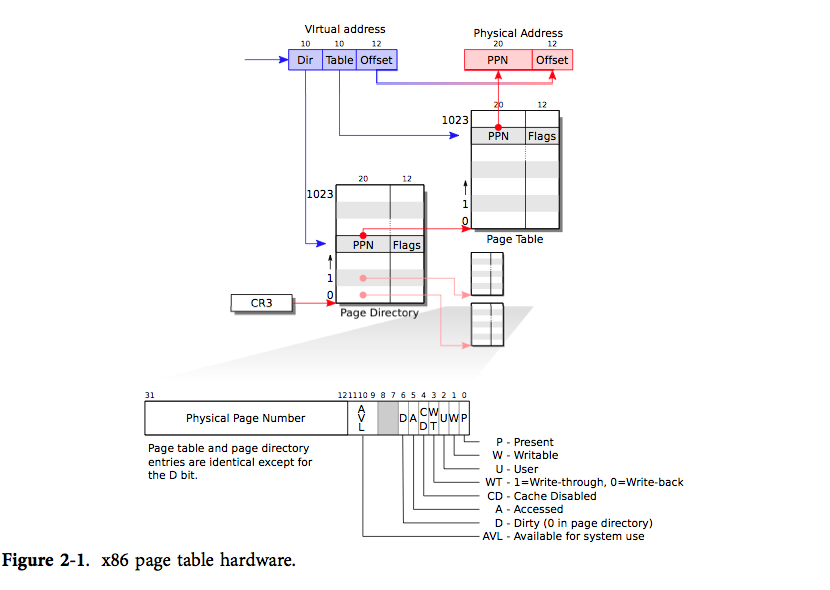

# 虚拟地址转物理地址

一般而言这一步其实是由 MMU（内存管理单元）来帮你做了，但是软件做也不是不可以。

~~AI给的示例~~。

```c++
#include <linux/module.h>
#include <linux/kernel.h>
#include <linux/mm.h>
#include <linux/highmem.h>
#include <linux/sched.h>
#include <linux/pid.h>

unsigned long vaddr_to_paddr(struct mm_struct *mm, unsigned long vaddr) {
    pgd_t *pgd;
    p4d_t *p4d;
    pud_t *pud;
    pmd_t *pmd;
    pte_t *pte;
    struct page *page;
    unsigned long paddr = 0;

    pgd = pgd_offset(mm, vaddr);
    if (pgd_none(*pgd) || pgd_bad(*pgd))
        return 0;

    p4d = p4d_offset(pgd, vaddr);
    if (p4d_none(*p4d) || p4d_bad(*p4d))
        return 0;

    pud = pud_offset(p4d, vaddr);
    if (pud_none(*pud) || pud_bad(*pud))
        return 0;

    pmd = pmd_offset(pud, vaddr);
    if (pmd_none(*pmd) || pmd_bad(*pmd))
        return 0;

    pte = pte_offset_map(pmd, vaddr);
    if (!pte)
        return 0;

    if (pte_present(*pte)) {
        page = pte_page(*pte);
        paddr = page_to_phys(page) | (vaddr & ~PAGE_MASK);
    }

    pte_unmap(pte);
    return paddr;
}

static int __init vaddr_to_paddr_init(void) {
    struct task_struct *task;
    struct mm_struct *mm;
    unsigned long vaddr = 0x12345678; // 示例虚拟地址
    unsigned long paddr;

    task = pid_task(find_vpid(1), PIDTYPE_PID); // 获取进程1（init进程）
    if (!task)
        return -1;

    mm = task->mm;
    paddr = vaddr_to_paddr(mm, vaddr);
    printk(KERN_INFO "虚拟地址 0x%lx 对应的物理地址是 0x%lx\n", vaddr, paddr);

    return 0;
}

static void __exit vaddr_to_paddr_exit(void) {
    printk(KERN_INFO "模块卸载\n");
}

module_init(vaddr_to_paddr_init);
module_exit(vaddr_to_paddr_exit);

MODULE_LICENSE("GPL");
MODULE_DESCRIPTION("虚拟地址到物理地址转换示例");
```

## xv6 中的实现

在 `kernel/vm.c` 中，xv6 实现了查找**用户页表**特定虚拟地址 va 到所对应的物理地址 pa：`walkaddr`。

原本的问题是：这里为什么是返回 0 ，而不是 panic ？一个简单的原因：没必要 panic。因为这里的错误不是系统层面的错误，而是用户层面的错误，用户进程可能需要访问到一个超过其虚拟内存大小位置的数据，但是显然操作系统不允许，这个时候有很多种选择：

- 系统 panic
- 杀掉用户进程
- 返回给调用该内核函数一个报错的标志

第一种，显然没必要，考虑到对于用户层面的报错，系统没停摆就能继续跑。对于第二种，如果不是内存满了之类的情况之下，那么因为可能的越界行为就把进程杀掉有点过头了。

对于第三种，直接丢回去，说：我这边发现你这玩意是错误的，你自己处理看看能不能处理掉这个错误。显然这是正确的做法。

```c
// Look up a virtual address, return the physical address,
// or 0 if not mapped.
// Can only be used to look up user pages.
uint64 walkaddr(pagetable_t pagetable, uint64 va)
{
  pte_t *pte;
  uint64 pa;

  // 如果虚拟地址大于最大虚拟地址，返回0
  // 物理地址为0的地方是未被使用的地址空间
  if(va >= MAXVA)
    return 0;

  // 调用walk函数，直接在用户页表中找到最低一级的PTE
  pte = walk(pagetable, va, 0);

  // 如果此PTE不存在，或者无效，或者用户无权访问
  if(pte == 0)
    return 0;
  if((*pte & PTE_V) == 0)
    return 0;
  if((*pte & PTE_U) == 0)
    return 0;

  // 从PTE中截取下来物理地址页号字段，直接返回
  pa = PTE2PA(*pte);
  return pa;
}
```

我们先不看这个函数的具体实现，先来看看 PTE 是个什么玩意？（如果你忘记的话）



这是 x86 的页表。一个页表就是一个大数组，其中包含了 $2^20$ 条页表条目（PTE，Page Table Entry）。每一条 PET 包含了一个 20 位的物理页号 (PPN，Pythcal Page Number)，还有标志这个位置的属性。MMU 怎么做到的呢？就是先找到 PTE ，然后去掉低位的一些权限位之类的属性位，然后就是真正的物理页号。

现在我们知道物理地址在哪里了，在 PTE 。但是我们要在哪里找到 PTE 呢？看看手头上是什么？一个用户空间里的虚拟内存地址，还有一个一坨 PTE 的页表，现在要怎么做？来看看 `walk` 干了啥？

```c
#define PXMASK          0x1FF // 9 bits
#define PXSHIFT(level)  (PGSHIFT+(9*(level)))
#define PX(level, va) ((((uint64) (va)) >> PXSHIFT(level)) & PXMASK)

#define PTE2PA(pte) (((pte) >> 10) << 12)
#define PA2PTE(pa) ((((uint64)pa) >> 12) << 10)

// Return the address of the PTE in page table pagetable
// that corresponds to virtual address va.  If alloc!=0,
// create any required page-table pages.
//
// The risc-v Sv39 scheme has three levels of page-table
// pages. A page-table page contains 512 64-bit PTEs.
// A 64-bit virtual address is split into five fields:
//   39..63 -- must be zero.
//   30..38 -- 9 bits of level-2 index.
//   21..29 -- 9 bits of level-1 index.
//   12..20 -- 9 bits of level-0 index.
//    0..11 -- 12 bits of byte offset within the page.
pte_t *walk(pagetable_t pagetable, uint64 va, int alloc)
{
  if(va >= MAXVA)
    panic("walk");

  for(int level = 2; level > 0; level--) {
    pte_t *pte = &pagetable[PX(level, va)];
    if(*pte & PTE_V) {
      pagetable = (pagetable_t)PTE2PA(*pte);
    } else {
      if(!alloc || (pagetable = (pde_t*)kalloc()) == 0)
        return 0;
      memset(pagetable, 0, PGSIZE);
      *pte = PA2PTE(pagetable) | PTE_V;
    }
  }
  return &pagetable[PX(0, va)];
}
```

很好，有个 `PX(level, va)` ，看起来是通过这个来索引找到的。返回到之前看到的 x86 那个结构上，仔细看看 VA 对应了啥？

1. dir 对应了一级页表，通过 dir 找到一级页表内部的 PPN ，这个 PPN 指向的是一个二级页表
2. Table 在之前找到的二级页表种，找到一个 PPN .
3. PPN 直接 offset 移位过去，这就是 PN。

这就是整个过程了。

> 为什么 offset 都一样？因为一般权限之类的标志位，都是一样的，统一就这么做了。

所以从虚拟地址转换到物理地址，其实就是这个过程，一个找到 PTE 的过程。为什么 MMU 能做？因为把这个过程从软件直接集成到了硬件上去了。
