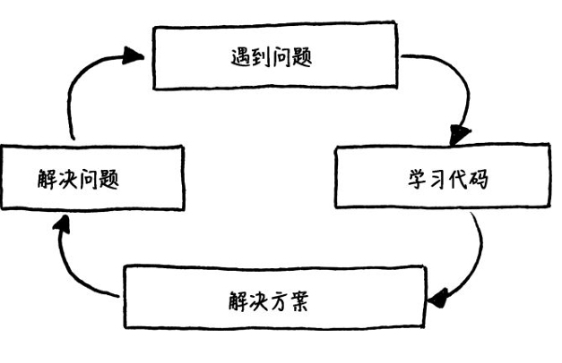

# CS Notes

> 我有很多我想要做，想要写的东西，但是我没多少时间
>
> 我没办法将之前的笔记一一搬运过来，因为我也忘记它们在哪里了
>
> 以后可能会重新对他们写一遍。

这是一个关于我个人平常学习的笔记积累。

为什么是现在才开始建立的呢？

因为我的个人博客被我自己销毁掉了（买的是国外的 `vps`），然后我文件找不到了（。

顺便这里重新整理一下一些可能会忘记的东西。

## 编程的流程

来自于《游戏编程模式》。

## 一些有用的文章

- [WebAssembly 介绍](https://www.smashingmagazine.com/2017/05/abridged-cartoon-introduction-webassembly/)

## 一些有用的网站

- [godbolt](https://godbolt.org/)